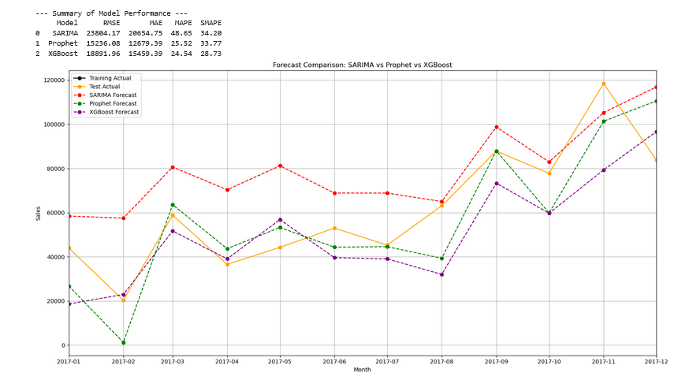

## 📊 Data

The project uses a time series dataset on Superstore dataset. The data is contained in the `data/Sample - Superstore.csv` file. The file should contain at least two columns: one for the date/time and one for the target value to be forecasted.

## 🛠️ Tools and Libraries Used

The project is developed in Python and utilizes the following main libraries:

*   `pandas`: For data manipulation and analysis.
*   `numpy`: For numerical operations.
*   `matplotlib`, `seaborn`: For data and results visualization.
*   `statsmodels`: For implementing the SARIMA model.
*   `prophet`: For implementing the Prophet model.
*   `xgboost`: For implementing the XGBoost model.
*   `scikit-learn`: For evaluating forecast accuracy metrics (RMSE, MAE, etc.).
*   (`pmdarima`): Can be used for auto-selection of SARIMA parameters.

## ⚙️ Setup and Running

To set up the project locally and view the portfolio:

1.  **Clone the repository:**
    ```bash
    git clone https://github.com/your_github_username/your_repository_name.git
    cd your_repository_name
    ```

2.  **Create a virtual environment (recommended):**
    ```bash
    python -m venv .venv
    # On Windows, activate with:
    .venv\Scripts\activate
    # On macOS/Linux, activate with:
    source .venv/bin/activate
    ```

3.  **Install the required libraries:**
    ```bash
    pip install -r requirements.txt
    ```
    *(If you don't have a `requirements.txt` file, you can create one manually listing the libraries from the "Tools Used" section, or install each library individually using `pip install <library_name>`)*.

4.  **Place your data:**
    Copy your data file (`Sample - Superstore.csv`) into the `data/` folder.

5.  **Run the Python scripts:**
    Execute each analysis script to generate forecasts, calculate metrics, and save plots into the `images/` folder. Run these scripts from the root directory of the repository.
    ```bash
    python sarima/sarima_code.py
    python prophet/prophet_code.py
    python xgboost/xgboost_code.py
    ```
    *(Ensure the scripts run without errors and confirm they save the plots).*

## 🌐 Viewing the Portfolio

After successfully running all Python scripts:

1.  Open the `index.html` file located in the root directory of the repository using any modern web browser.
2.  The main page provides links to the individual pages for each method, where you can find descriptions, code snippets, plots, and metrics.

## 📈 Results

On each method's page (`sarima.html`, `prophet.html`, `xgboost.html`), you will find:

*   A brief description of the method.
*   Key snippets of the Python code used.
*   Plots comparing actual values vs. forecasts on the test set.
*   Plots showing future forecasts.
*   Forecasting accuracy metrics (RMSE, MAE, etc.).
*   Brief conclusions on how the method performed on the data.


Comparison of Predictions on Test Set:




## ✍️ Author

*   Olha Shaptala
*   [Link to your GitHub profile](https://github.com/orangegreen212)
*   [Link to your LinkedIn profile](https://www.linkedin.com/in/olyashaptala/)

---

*Thank you for checking out my portfolio! I hope you find it informative.*
